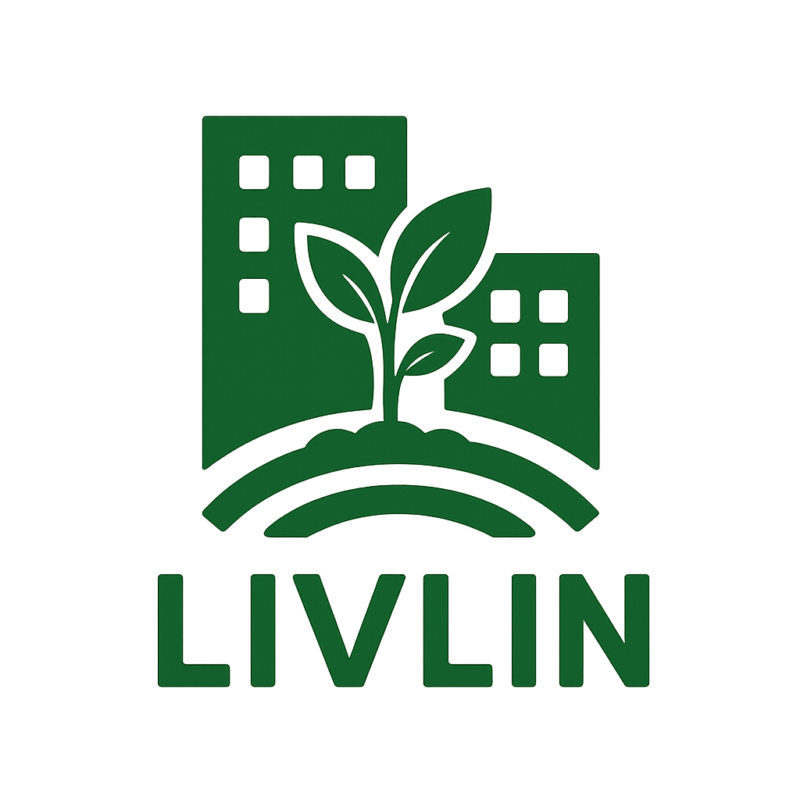

# LivLin · Sitio web

Sitio estático bilingüe (ES/EN) para www.livlin.cl, alojado en GitHub Pages.

> **Más naturaleza** — Consultora estratégica en sostenibilidad y regeneración.

---

## 🚀 Cómo desplegar

### Opción A · Reemplazar repo existente

1. Descomprime este `.zip` en tu carpeta local.
2. Borra todo el contenido del repo `https://github.com/LinFrancis/livlin` **excepto** `.git/`.
3. Copia todos los archivos de este zip al repo.
4. `git add . && git commit -m "Nuevo sitio LivLin" && git push`.
5. Verifica en GitHub Settings → Pages que el dominio `www.livlin.cl` esté configurado.
6. El archivo `CNAME` ya está incluido para el dominio personalizado.
7. El `.nojekyll` evita procesamiento extra de Jekyll.

### Opción B · Probar localmente

```bash
# Desde la carpeta livlin/
python3 -m http.server 8000
# Abre http://localhost:8000
```

---

## 📁 Estructura

```
livlin/
├── index.html              # Página principal (todas las secciones)
├── recursos.html           # Página de recursos (guía + Tao)
├── servicios/
│   ├── diseno.html         # Servicio 1: Diseño regenerativo
│   ├── implementacion.html # Servicio 2: Implementación
│   └── monitoreo.html      # Servicio 3: Monitoreo y herramientas
├── css/styles.css          # Sistema de diseño completo
├── js/script.js            # Lang switcher · menú móvil · animaciones
├── images/
│   ├── logo_livlin.svg     # Logo (placeholder, reemplazable)
│   ├── hero/               # Imagen del hero
│   ├── projects/           # Imágenes de proyectos
│   ├── apps/               # Screenshots de plataformas
│   ├── people/             # Foto de Francis
│   └── contact/            # QR codes (WhatsApp, WeChat, Line)
├── CNAME                   # Dominio personalizado
├── .nojekyll               # GitHub Pages: sin Jekyll
└── README.md               # Este archivo
```

---

## 🌐 Multilingüe (ES / EN)

El sitio detecta automáticamente el idioma vía URL:

- **Español (default):** `https://www.livlin.cl/`
- **English:** `https://www.livlin.cl/?lang=en`

Cada elemento traducible tiene atributos `data-es` y `data-en`. El JS los aplica al cargar y al cambiar de idioma con el selector flotante (esquina inferior derecha).

### Para agregar nuevo contenido bilingüe:

```html
<h1 data-es="Texto en español" data-en="Text in English">
  Texto en español (default)
</h1>
```

---

## 🎨 Sistema de diseño

### Paleta de colores (CSS variables en `:root`)
- `--green-light: #7ADAA5` — verde principal
- `--teal: #239BA7` — teal
- `--amber: #E1AA36` — acento ámbar
- `--text: #112E4D` — navy oscuro (texto)
- `--bg: #FAF9F4` — fondo cream
- `--cream: #F6F3E9` — cream alternativo

### Tipografías
- **Titulares:** Merriweather (serif)
- **Texto / UI:** Poppins (sans-serif)

Cargadas vía Google Fonts.

---

## ✏️ Cómo editar contenido

### Cambiar el logo
Reemplaza `images/logo_livlin.svg` por tu PNG real (mantén el nombre o actualiza las referencias en los HTML). Si usas PNG:

```html

```

### Cambiar imágenes
Las imágenes están organizadas por categoría en `images/`. Reemplázalas manteniendo los mismos nombres.

### Editar textos
Cada HTML tiene los textos en español como contenido directo y en inglés en `data-en="..."`. Edita ambos para mantener la coherencia bilingüe.

### Agregar Google Analytics (cuando lo desees)
Pega el snippet de GA antes de `</head>` en cada HTML.

---

## 📞 Datos de contacto en el sitio

- **WhatsApp:** +56 9 5110 8051 → `https://wa.me/56951108051`
- **Email:** contacto.livlin@gmail.com
- **LinkedIn:** https://www.linkedin.com/in/francis-mason/

Para cambiarlos, busca y reemplaza en todos los HTML.

---

## 🛠 Herramientas externas referenciadas

| Plataforma | URL |
|---|---|
| Plataforma LivLin (Indagación Regenerativa) | https://livlin.streamlit.app/ |
| Mapeo de Cuencas | https://mapeocuencas.streamlit.app/ |
| Agentes Regenerativos / Puentes | https://puentesregenerativos.streamlit.app/ |
| Theory of Change | https://theoryofchange.streamlit.app/ |
| Tao para una vida regenerativa (PDF) | https://drive.google.com/file/d/1MLOLcIso_inxbpIaoJfcdrZimVl9xHgj/view |

---

## ✅ Pendientes / Próximos pasos sugeridos

- [ ] Reemplazar el logo SVG placeholder por el PNG oficial.
- [ ] Subir el PDF de la guía «Indagación Regenerativa» y enlazarlo en `recursos.html#guia`.
- [ ] Reemplazar screenshots genéricos de `images/apps/` por capturas reales de cada app cuando estén disponibles.
- [ ] Agregar Google Analytics (opcional).
- [ ] Tomar fotos reales de proyectos con clientes para reemplazar imágenes genéricas.
- [ ] Migrar el texto del Tao desde el PDF cuando se integre directamente en la página.

---

## 🌱 Filosofía del sitio

Este sitio refleja el enfoque de LivLin:
- **Modular:** cada servicio es independiente pero se conecta con los otros.
- **Honesto:** no infla casos. Lo que está en desarrollo se marca como tal.
- **Bilingüe:** abre la puerta a clientes internacionales sin duplicar contenido.
- **Liviano:** HTML/CSS/JS puro, sin frameworks. Carga rápida en cualquier conexión.
- **Accesible:** semántica clara, contraste cuidado, soporta `prefers-reduced-motion`.

---

© LivLin · Francis Mason · Santiago de Chile
